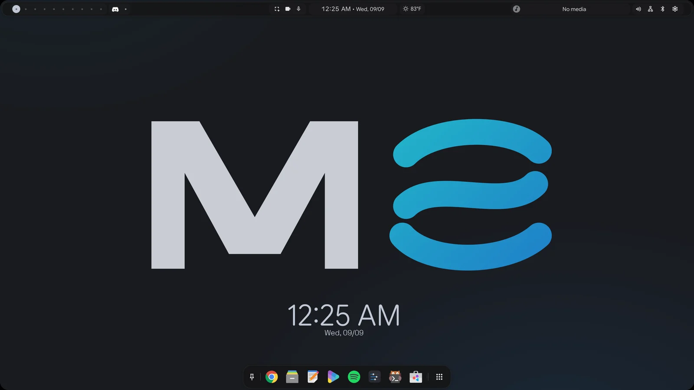
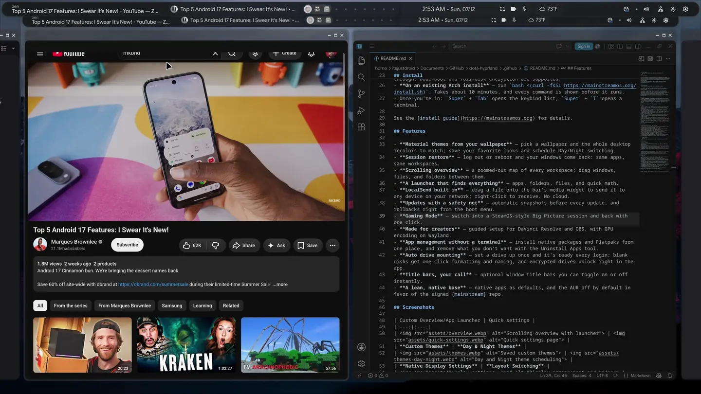
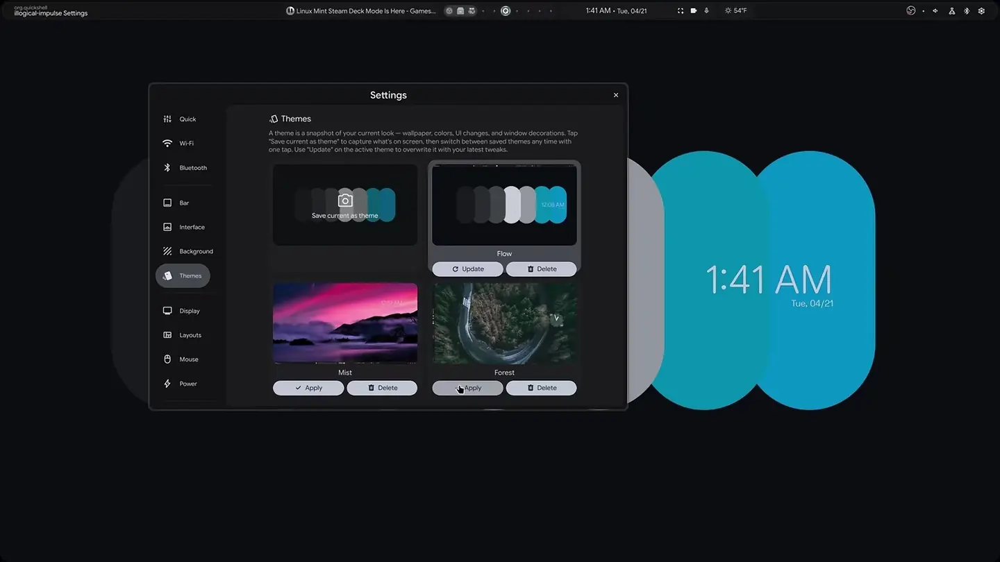
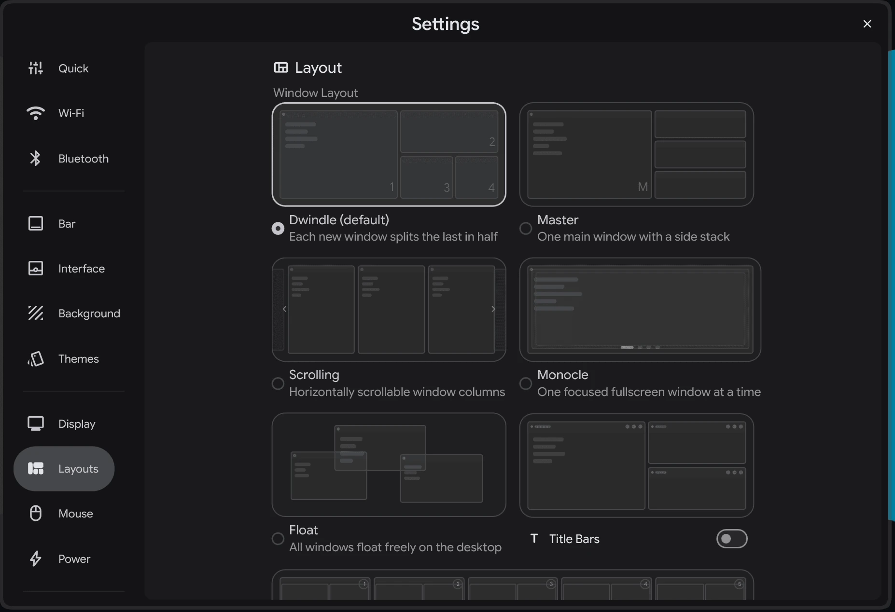
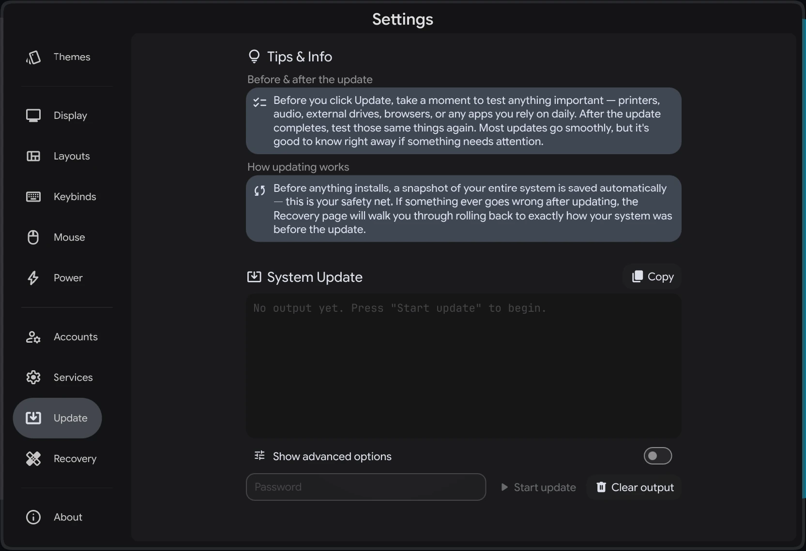
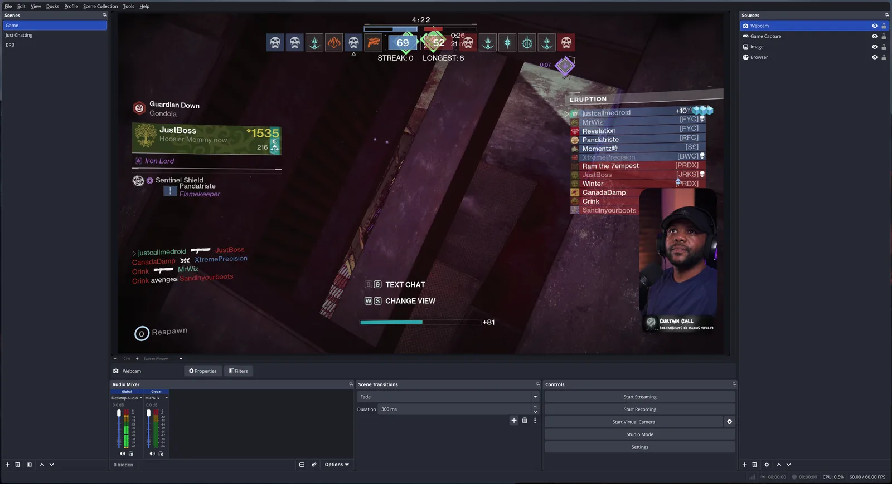
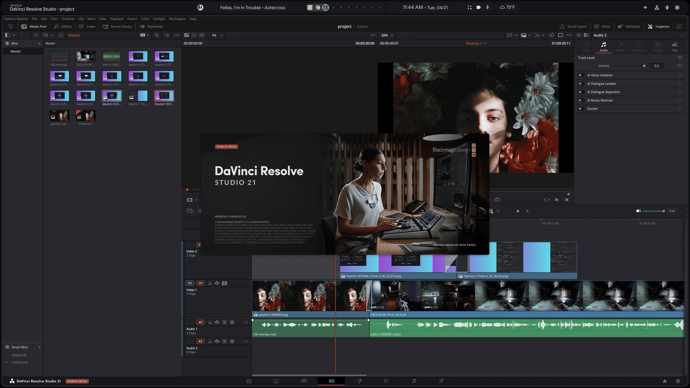

<div align="center">


<a href="https://mainstreamos.org"></a>

</div>

<div align="center">
    
</div>

Mainstream OS is a Linux operating system built on Arch. Its desktop is Hyprland — the software that arranges your windows and decides where they go — and Hyprland is normally set up by hand, by editing text files. Here you set it up by clicking: displays, window layouts, keyboard shortcuts, the bar, the look of the whole interface, updates and repairs each get a proper settings page — a settings app, not a config file, and never a terminal. Pick a wallpaper and the whole desktop takes its colors from it. One keypress hands the machine over to a full-screen Steam session for gaming. **Deeply featured. Genuinely friendly.**

This repository is the desktop itself — the Quickshell shell, the Hyprland configuration, and the `./setup` tooling that turns a fresh Arch install into Mainstream OS. The ISO builder lives at [MainstreamOS/archiso](https://github.com/MainstreamOS/archiso) and the signed package repo at [MainstreamOS/packages](https://github.com/MainstreamOS/packages).

The shell — the bar, the side panels, the search box — is a lean, heavily modified version of [end-4](https://github.com/end-4)'s [illogical-impulse](https://github.com/end-4/dots-hyprland). Mainstream ships it the way Ubuntu ships GNOME: as one openly credited part of a complete operating system. Improvements from the original are still taken in periodically, and fixes found here are offered back rather than kept private. It has grown since: the dock, the app drawer, file search, the bar's layout system and its media handling, and the theme system are largely Mainstream's now. A theme saves the window styling — rounding, gaps, blur, shadows, opacity, animations — along with the per-app window rules, the app style, the icon and cursor themes, the font choices, the wallpaper, and the colors, which are still generated by end-4's color engine. It all exports to one file that imports on another computer, wallpaper included, and themes can be paired, one for day and one for night. So is everything around the shell: the installer, the settings app, the package repository, the backup and repair tools, the gaming session.

## Install

- **The OS (recommended)** — [Download the ISO](https://mainstreamos.org/download) (x86_64 · 3.4 GB), flash it to a USB drive, boot and click through. Dual-boot and full-disk encryption are set up during the install itself. An experimental legacy-NVIDIA edition (4.8 GB) covers older NVIDIA cards, back to the GeForce 400 series.
- **On an existing Arch install** — one command, about 10 minutes:

  ```bash
  bash <(curl -fsSL https://mainstreamos.org/install.sh)
  ```

  That installs the newest numbered release — the same one the ISO ships and Settings → Update tracks. Options for the install itself go **after a `--` separator**; `--edge` goes before it and installs the `mainstream` branch as it stands, ahead of any release:

  ```bash
  bash <(curl -fsSL https://mainstreamos.org/install.sh) -- --os-only   # desktop only, without the default apps
  bash <(curl -fsSL https://mainstreamos.org/install.sh) -- --console   # gaming / console install
  bash <(curl -fsSL https://mainstreamos.org/install.sh) -- --verbose   # confirm each command before it runs
  bash <(curl -fsSL https://mainstreamos.org/install.sh) --edge         # the mainstream branch, ahead of any release
  ```

  See [all the options](https://mainstreamos.org/#install-script).
- Once you're in: `Super` + `Tab` opens the keybind list, `Super` + `T` opens a terminal.

See the [install guides](https://mainstreamos.org/#install-iso) for details.

## Features

- **Every setting lives in one place** — wallpaper and colors, the UI, display and layout switching, keybinds and updates — a settings app, not a config file, and never a terminal. Snapshots keep experimenting safe.
    - **Displays** — arrange monitors and set resolution, refresh rate, scale, orientation, HDR and color profiles, or mirror one screen onto another.
    - **Layout switching** — dwindle, master, scrolling, monocle, or float: four ways of arranging windows automatically plus a floating mode, per workspace, on the fly.
    - **Keybinds** — a real editor rather than a printed list. Change the ones that ship, add your own, and set them by pressing the keys you want.
    - **Touchpad gestures** — remap every swipe and pinch, applied instantly.
    - **Title bars** — toggle window title bars on or off instantly.
    - **App management** — install and remove native packages and Flatpaks, no terminal.
    - **Auto drive mounting** — set a drive up once and it's ready every login; format blank disks and unlock encrypted ones in the app.
- **Whole-desktop Material You** — pick a wallpaper, a still image or a video, and the shell, the settings app, your terminal, your apps, your folder icons, and the lock screen all recolor to match it.
- **Themes you can save, schedule, and share** — your whole look — wallpaper, colors, app style, icons, interface changes, window styling, and which edge the dock sits on — saves under a name with a preview and switches back in one tap. Pair a Day and Night theme that follow Night Light or your own set hours, or export a theme to a single file and import it on another computer.
- **A bar you arrange** — show, hide, and reorder every piece of the bar by dragging, move them between the left, middle, and right, and drop two together to join them into a single rounded group.
- **A dock on any edge** — put the dock along the top, bottom, left, or right of the screen, and the bar steps aside when you give the dock the edge it was using.
- **Four bar styles.** Hug, Float, Rect, or Notch, which sits on the screen edge and curves away from it. Set the shape, transparency, color and width of the bar and of each widget on it, and split a floating bar into three strips.
- **A settings page for the dock.** Size, shape, corner roundness, transparency and color, in a Float, Rect or Notch style.
- **A dock that behaves how you like.** Set how far an icon grows on hover and whether hovering magnifies or glows, mark open windows with dashes, dots or a count badge, choose the animation when you click an app, and turn the buttons on either side on or off.
- **Title bars in your colors.** Set their color and opacity, and return to stock in one press.
- **Windows drawn the way you want** — corner radius, border thickness, the gaps between windows and around the screen, how see-through focused and unfocused windows are, the blur behind them, the shadow beneath them, and how they animate. Give the borders a gradient of your own, or leave them following the wallpaper. One press puts it all back.
- **A built-in window rule editor** — most desktops leave per-app rules to a config file you edit by hand. Here it is a page in Settings: teach one app where to open, whether it floats, how see-through it is, and what it is allowed to do. Rules save into a theme, so sharing a theme shares the behavior too.
- **A wallpaper that rotates** — point it at a folder and set a timer; the colors follow along with every picture.
- **App style, icons, pointer, and fonts** — all pickers in Settings, with a font list that shows each font in its own lettering. Your choice carries into your apps, not just the shell.
- **Gaming Mode** — `Super` + `G` puts the desktop away and hands the machine to a full-screen gamescope Steam session, the same session model a Steam Deck runs, then gives the desktop back. AMD, Intel, and NVIDIA alike. Proton GE is installed and set as Steam's default, so Windows titles run the first time you open them.
- **Console Mode** — an install option that starts straight into that session and sets up game controllers, turning a computer under the TV into a console, with the full desktop still there whenever you want it.
- **A launcher that finds everything** — apps, folders, files, quick math, and your clipboard history.
- **Overviews** — a hot corner or `Super` + `F10` opens a map of every workspace; drag windows between them and drop files and folders in. The scrolling layout has its own panning view on `Super` + `O`.
- **Session restore** — log out or reboot and your windows come back on the workspaces they were on.
- **AI in the sidebar.** Sign in to Claude or ChatGPT with a subscription you already have and no API key to paste, or follow a guided setup for free local AI with Ollama, where nothing you type leaves the computer.
- **Made with creators in mind** — one-click install for DaVinci Resolve and OBS, with GPU encoding on Wayland.
- **LocalSend built in** — drag files onto the bar's media widget to send them to any phone, tablet, or computer on your network running [LocalSend](https://localsend.org), and right-click to receive, with live progress and no cloud in the middle. Built into the desktop rather than bundled as a separate app.
- **Graphics sorted out during the install** — your card is recognized and given drivers that match the model you actually have, across AMD, Intel, and NVIDIA, laptops with two included. The experimental legacy-NVIDIA edition covers older NVIDIA cards, back to the GeForce 400 series.
- **Your language from the start.** Pick a language and keyboard layout during installation and both are waiting at the login screen and in the desktop. Choosing Chinese, Japanese or Korean installs the matching fonts and input method.
- **Updates with a safety net** — system packages, Flatpaks, and the desktop update together from a single button, with a restore point taken before and after. A bad update is one boot-menu entry away from being undone, and a marker on the bar tells you when a new release is out.
- **Repair Install** — one button re-runs the desktop setup and rebuilds its components.
- **A firewall you can see into.** Every install runs firewalld, and a page on the site explains exactly what it is doing for you.
- **Verified installs** — a post-install self-check runs on the finished system and writes a health report, so a bad install tells you instead of failing silently.
- **Signed downloads and packages** — every release is signed with checksums published alongside it, and everything Mainstream adds arrives prebuilt and signed in the [\[mainstream\]](https://github.com/MainstreamOS/packages) repo.
- **A lean, native base** — native apps as defaults, and the AUR off by default in favor of the signed repo.

## Screenshots

<div align="center">
    <b>Scrolling Overview</b>
    <br><br>
    
</div>

<div align="center">
    <b>Theme Switching</b>
    <br><br>
    
</div>

<div align="center">
    <b>Gaming Mode</b>
    <br><br>
    
</div>

| Custom Overview/App Launcher | Quick settings |
|:---:|:---:|
|  |  |
| **Native Display Settings** | **Layout Switching** |
|  |  |
| **One Click Full Update** | **Automatic Recovery** |
|  |  |
| **One Click Full Featured OBS Install** | **One Click DaVinci Resolve Setup** |
|  |  |

## Under the hood

| Software | Purpose |
| ------------- | ------------- |
| [Hyprland](https://github.com/hyprwm/hyprland) | The compositor (manages and renders windows) |
| [Quickshell](https://quickshell.outfoxxed.me/) | The shell: bar, dock, overview, settings, lock screen |
| [Calamares](https://github.com/MainstreamOS/calamares) | The graphical installer |
| [Limine](https://github.com/limine-bootloader/limine) + [Snapper](https://github.com/openSUSE/snapper) | Boot menu with snapshot rollbacks |
| [Mainstream Repo](https://github.com/MainstreamOS/packages) | Signed repo of prebuilt packages — no AUR builds on your machine |

## Support

- [Discord](https://discord.gg/WJ3AUK5Aqd) — live help and community
- [Documentation](https://mainstreamos.org) — install guides, every settings page, creative setup, and the security model
- [Issues](https://github.com/MainstreamOS/dots-hyprland/issues) for bugs, [Discussions](https://github.com/MainstreamOS/dots-hyprland/discussions) for questions and ideas

## Contributing

Contributions are welcome — code, docs, bug reports, or ideas. Two are especially wanted:

- **Translations.** Mainstream should feel native well beyond English. If you speak another language, help is genuinely appreciated.
- **Honest feedback.** Nobody working on Mainstream is above reproach — if a decision looks off or something needs addressing, open an issue or a discussion. Questions and criticism are how it gets better.

Fixes to the upstream shell go back to [illogical-impulse](https://github.com/end-4/dots-hyprland) as pull requests.

## Thank you

- [end-4](https://github.com/end-4) ([sponsor](https://github.com/sponsors/end-4)), for [illogical-impulse](https://github.com/end-4/dots-hyprland) — the starting point for Mainstream's shell
- [@clsty](https://github.com/clsty) for the original install tooling
- [@midn8hustlr](https://github.com/midn8hustlr) for the color generation system
- [@outfoxxed](https://github.com/outfoxxed/) for [Quickshell](https://quickshell.outfoxxed.me/)
- [@yayuuu](https://github.com/yayuuu) for [Scroll Overview](https://github.com/yayuuu/hyprland-scroll-overview), the plugin behind the scrolling overview
- [@sanaruca](https://github.com/sanaruca) for the dock launch animations ([end-4/dots-hyprland#3553](https://github.com/end-4/dots-hyprland/issues/3553))
- The [LocalSend](https://localsend.org) project, whose protocol powers device-to-device transfers
- The [Calamares](https://calamares.io) team for the installer framework
- [@ful1e5](https://github.com/ful1e5) ([sponsor](https://github.com/sponsors/ful1e5)) for the [Bibata](https://github.com/ful1e5/Bibata_Cursor) cursor theme
- [@xCaptaiN09](https://github.com/xCaptaiN09) for the [Pixie](https://github.com/xCaptaiN09/pixie-sddm) SDDM theme
- [@BlueManCZ](https://github.com/BlueManCZ) for [hyprmod](https://github.com/BlueManCZ/hyprmod), the base of the Keybinds settings
- [Arch Linux](https://archlinux.org) ([sponsor](https://github.com/sponsors/archlinux)) — the base distribution and archiso

The full project list, with sponsor links, also lives in Settings → About.

## License

[GPLv3](../LICENSE). Copying: absolutely, feel free — just follow the license and it's all good.
